<h1 align="center">BOSCH INTER IIT TECH MEET</h1>

## Table of Contents

[**1**. Description](#description)  
[**2**. Data Creation](#datacreation)  
[**3**. Data Augmentation](#da)  
[**4**. Model](#model)

- [Regularization](#regularization)
- [Spatial Transformers Network](#stn)
- [Baseline Model](#bm)
- [Incremental Learning](#il)

[**5**. Evaluation](#evaluation)  
[**6**. Setting up your machine](#settingupmachine)  
[**7**. Setting up UI](#settingupui)  
[**8**. Setting up Firebase](#settingupfirebase)  
[**9**. Setting up Backend](#settingupbackend)  
[**10**. Flowchart](#flowchart)  
[**11**. Usage](#usage)  
[**12**. Dashboard](#dashboard)

<h2 id="description">Description</h2>

This project is about German Traffic Sign Recognition and uses the German Traffic Sign Recognition Benchmark Dataset to train the model. It has a user friendly Ui which provides the user a easy and interactive way to use this model. It is built with NextJs and Flask for the forntend and backend respectively. User will have the ability to add specific images using a level of randomization to the dataset, for every class. Users will also be provided with reasonable control over the type of augmentations, transformations to be added to the images. The user will be able to visualize the additional images after augmentations, transformations and will also have the freedom to balance the updated dataset, curate it and split it into train and validation. Moreover the UI will allow users to easily play with the metrics which will provide the reason and information if the network fails in some place or what steps should be taken to make the experiment work.

**<h2 id="datacreation">Data Creation</h2>**

We use the GTSRB dataset (German Traffic Sign Recognition Benchmark) provided by the Institut für Neuroinformatik group. Images are spread across 43 different types of traffic signs and contain a total of 39,209 train examples. As per our analysis of the dataset, it is very unbalanced, some of the classes having 2000 samples, and some of them having only 200 samples. Although the images in each class of the dataset have some variance the number of images in some classes is so shallow that we had to append images to the existing dataset further to improve its variance. Although we couldn’t compensate for the class imbalance present in the dataset, our aim in adding the new images was to improve the overall diversity of the dataset

<div align="center">
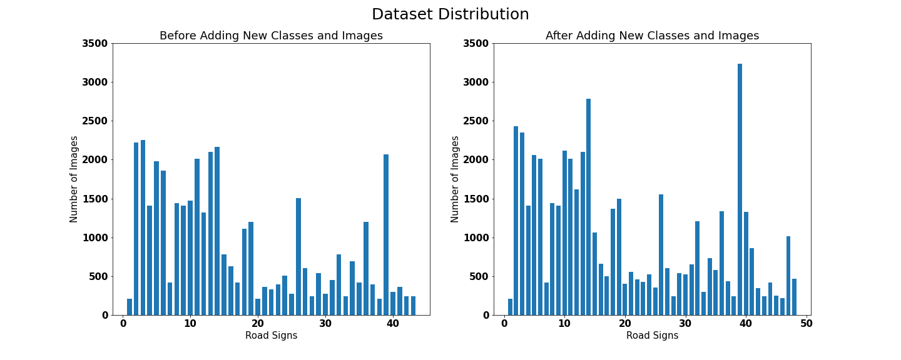
</div>

We introduced 5 new classes which consist of signs for the bus stop, crossing ahead, no stopping, no priority road, and school ahead to the dataset by scraping data from the internet. The dataset consists of images of only the road signs rather than a whole scene, so our proposed model could identify a road sign more effectively if the input of only the cropped road sign is fed to it rather than a whole scene which consists of the road sign.

**<h2 id="da">Data Augmentation</h2>**

**<h2 id="model">Model</h2>**

We implemented the original [IDSIA MCDNN](https://people.lu.usi.ch/mascij/data/papers/2012_nn_traffic.pdf) model with an extra batch normalization layer and several other modifications.

**<h3 id="regularization">Regularization</h3>**

We use the following regularization techniques to prevent overfitting:

**Dropout**: A simple way to prevent neural networks from overfitting. Dropout is a regularization method that approximates training a large number of neural networks with different architectures in parallel. During training, some number of layer outputs are randomly ignored.

**Batch Normalization**: During training time, the distribution of the activations is constantly changing. The intermediate layers must learn to adapt themselves to a new distribution in every training step, so training processes slow down. Batch normalization is a method to normalize the inputs of each layer, to fight the internal covariate shift problem.

**Early Stopping**: A major challenge in training neural networks is how long to train them. If we use too few epochs, we might underfit; if we use too many epochs, we might overfit. A compromise is to train on the training dataset but to stop training at the point when performance on a validation dataset starts to degrade. This simple, effective, and widely used approach to training neural networks is called early stopping. We used early stopping with a patience of 100 epochs. After the validation loss has not improved after 15 epochs, training is stopped.

**<h3 id="stn">Spatial Transformer Networks</h3>**

The problem with CNN’s is that they don’t efficiently learn spatial invariances. A few years ago, DeepMind released an awesome paper called Spatial Transformer Networks aiming at boosting the geometric invariance of CNNs in a very elegant way.

The goal of Spatial transformer networks (STN for short) is to add to your base network a layer able to perform an explicit geometric transformation on an input. STN is a generalization of differentiable attention to any spatial transformation. It allows a neural network to learn how to perform spatial transformations on the input image to enhance the geometric invariance of the model.

<div align="center">
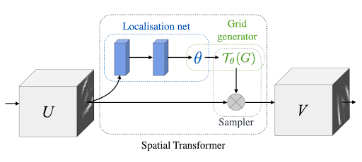
</div>

The layer is composed of 3 elements:

1. The localization network takes the original image as an input and outputs the parameters of the transformation we want to apply.
2. The grid generator generates a grid of coordinates in the input image corresponding to each pixel from the output image.
3. The sampler generates the output image using the grid given by the grid generator.

The given dataset shows that the traffic signs were taken at a wide variety of angles and distances. So we preprocessed the input image by the Spatial Transformer Networks.

**<h3 id="bm">Baseline Model</h3>**

We start by splitting the data into train and validation sets with a train to validation ratio of 4:1 and with a batch size of 64. We do not apply any fancy image augmentations but all the train and validation images are resized to 32x32 pixels and normalized to a mean of [0.3401,0.3120,0.3212] and a standard deviation of [0.2725,0.2609,0.2669] which were calculated on a train set of images.

We used Adam optimizer with a learning rate of 0.001 and Cross-Entropy Loss as the criterion. The baseline models were trained on using the above-mentioned model and regularisation parameters for a few hundred epochs.

**<h3 id="il">Incremental Learning</h3>**

We use the same baseline model as stated above but with a few changes to training a model on uploaded images.

Training a new model every time the user uploads a new set of images is time-consuming and there may not be a major change in how the model learns the representation of the classes. Due to our limit in resources and time, we have chosen to implement incremental learning to train on images uploaded by the user through the provided GUI.

Incremental learning is a method of machine learning in which input data is continuously used to extend the existing model's knowledge i.e. to further train the model. It represents a dynamic technique of supervised learning and unsupervised learning that can be applied when training data becomes available gradually over time or its size is out of system memory limits.

The aim of incremental learning is for the learning model to adapt to new data without forgetting its existing knowledge. We have implemented the most rudimentary way of applying Incremental learning using the principles of transfer learning.

The model is trained on only the newly uploaded images by the user with a reduced learning rate and epoch count. Through our experiments, we found out that keeping the learning rate low prevented the model from forgetting previously learnt representation of classes and reducing the epoch count to around 10%-20% of the original base model epochs, preventing the model from overfitting on the newly added images.

The preprocessing and augmentation of images will take place as directed by the user in the UI provided at the time of uploading the images and saved them in the designated folder.

**<h2 id="evaluation">Evaluation</h2>**

We have chosen loss, accuracy and weighted F1 score as metrics on which we make our decisions. We plot the graphs of the above-mentioned metrics against the epochs for both training and validation datasets. The plots help analyse the performance of the model over a period of time and help in deciding hyper-parameters such as the number of epochs for early-stopping, and also the stability of training and validation.

We also present a classification report using the SKLearn library, which shows class-wise precision, recall and f1 score, along with accuracy, macro and weighted f1 score on the whole dataset. This helps analyse class wise performance such as over and under-fitting when compared between train and validation classification reports. Hence, helps in adding new images to a particular class rather than on the whole dataset etc.

We provide a saliency map on the images used for training and validation. Deep learning models are often thought of as black-boxes, making them difficult to interpret and debug. The saliency map shows the pixel-wise importance of an image to the neural network trained on it. The higher the importance of the pixel in helping classify the image, the brighter the colour of the pixel in the saliency map. We use the gradients of w.r.t the input images to calculate the feature importance, as the higher the gradient of the predicted class w.r.t to an input feature (pixel) the higher is its correlation with the output, and hence higher the importance. The saliency map helps us understand how the deep learning model sees the input image and whether the image features are captured correctly or not. For example, images that are rotated from their usual position or shifted relative to the frame may not be captured well and will be visible in the saliency map, as the network may have been trained on centred images and specific orientation. The model then can be trained on augmented images making the model more robust to changes.

<h2 id="settingupmachine">Setting up your machine</h2>

> In order to run the project, your machine will need to download few things to set the enviroment and avoid any breakdowns while running.

**1**. Download npm. You can download npm along with nodejs according to your os from here:
https://nodejs.org/en/download/

To check if it has downloaded run the following command:

```bash
npm --version
```

If it shows the version number then you have successfully downloaded npm.

**2**. Download Yarn package manager through npm. Run the following command in your terminal:

```bash
npm install --global yarn
```

**3**. Install git according to your os from here:  
https://git-scm.com/book/en/v2/Getting-Started-Installing-Git

<h2 id="settingupui">Setting up UI</h2>

**1**. Clone this repo

```bash
git clone https://github.com/dhritimaandas/Traffic_Sign_Recog_Inter_IIT.git
cd Traffic_Sign_Recog_Inter_IIT/ui
```

**2**. Now since you are in the root directory for the Next.Js project, install the required packages.

```bash
yarn install
```

**3**. Now run the development server.

```bash
yarn dev
```

Open [http://localhost:3000](http://localhost:3000) with your browser to see the result.

<h2 id="settingupfirebase">Setting up Firebase</h2>

Replace the **firebaseConfig** file with your own config file in Traffic_Sign_Recog_Inter_IIT/backend/config/

<h2 id="settingupbackend">Setting up Backend</h2>

**1**. Clone this repo using

```bash
git clone https://github.com/dhritimaandas/Traffic_Sign_Recog_Inter_IIT.git
```

**2**. Navigate to working directory and then to backend folder using

```bash
cd backend
```

**3**. Make sure you have installed pipenv. If not run the command

```bash
pip install pipenv
```

**4**. Spawn a new virtual environment

```bash
pipenv shell
```

**5**. Download all the dependencies

```bash
pipenv install
```

**6**. To run flask app execute

```bash
python app.py
```

<h2 id="flowchart">Flowchart</h2>

### **Training Flowchart**

<div align="center">
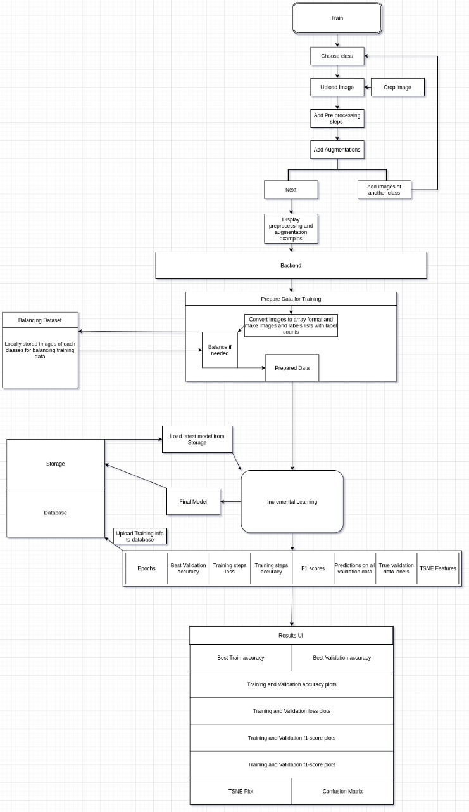
</div>
<br>

### **Prediction Flowchart**

<div align="center">
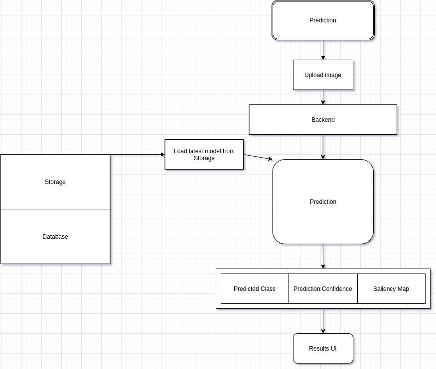
</div>
<br>

<h2 id="usage">Usage</h2>

<h3>Step 1</h3>

Choose a class from the given options and add images through the "Add Images" button.

<div align="center">
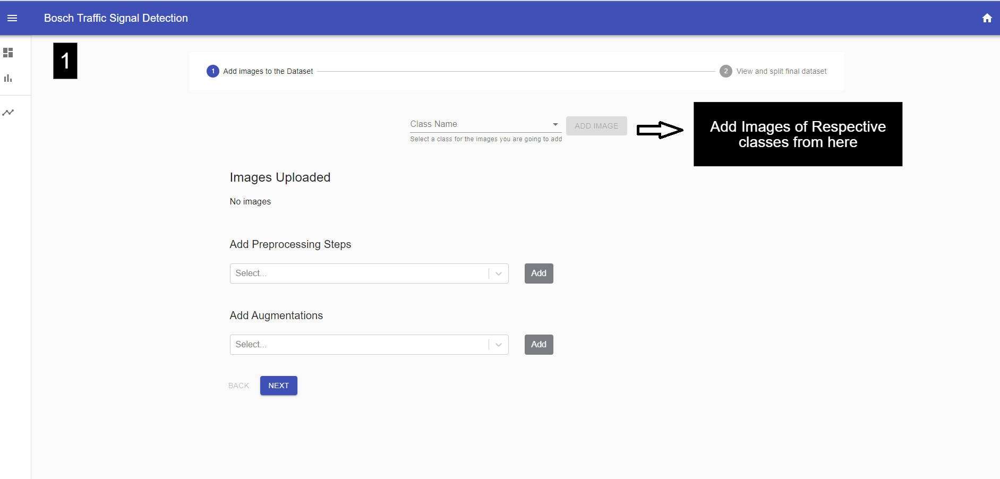
</div>
<br>
<h3>Step 2</h3>

You can crop your images with the shown crop button

<div align="center">
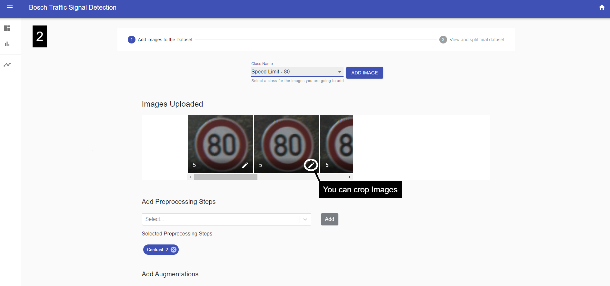
</div>
<br>
<h3>Step 3</h3>

After cropping the image you will see a side-by-side comparison of the original and the cropped image.

<div align="center">
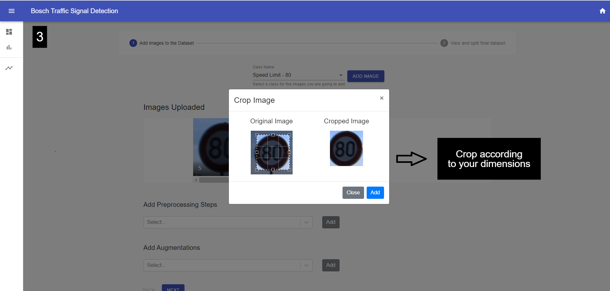
</div>
<br>
<h3>Step 4</h3>

You can add several preprocessing techniques to your images as shown

<div align="center">
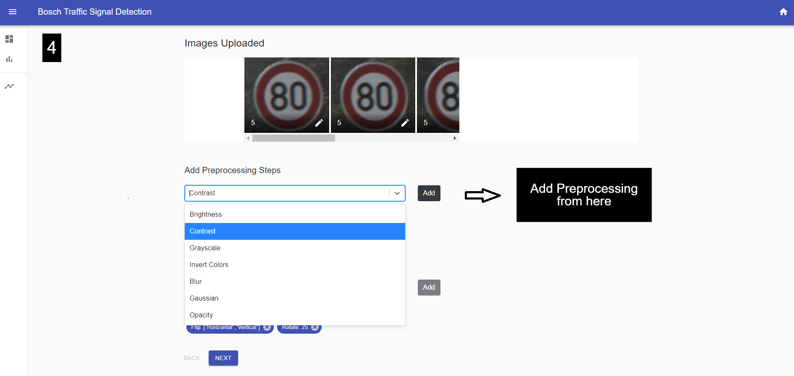
</div>
<br>
<h3>Step 5</h3>

You can add augmentations to your images as shown

<div align="center">
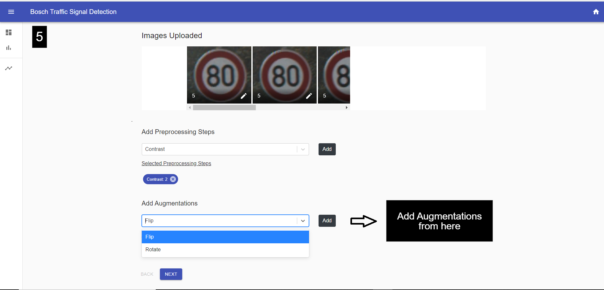
</div>
<br>
<h3>Step 6</h3>

You can check the final images sent here and if you don't like feel free to reset your progress.

<div align="center">
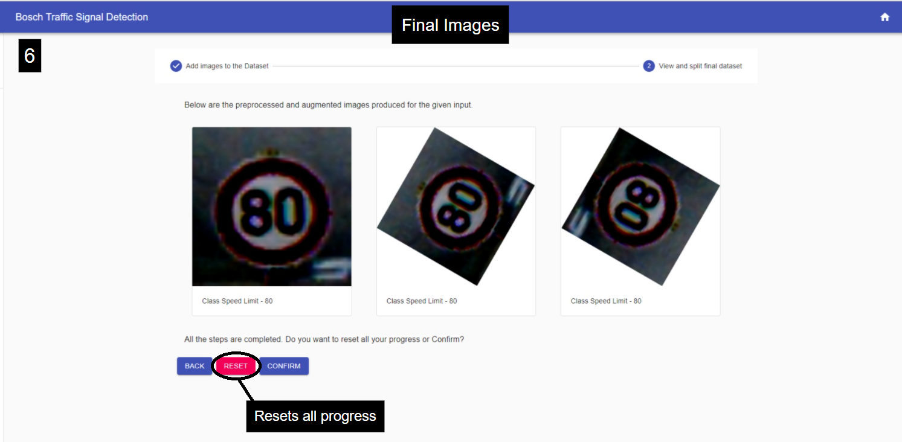
</div>
<br>
<h3>Step 7</h3>

You can balance and spilt the dataset from here.

<div align="center">
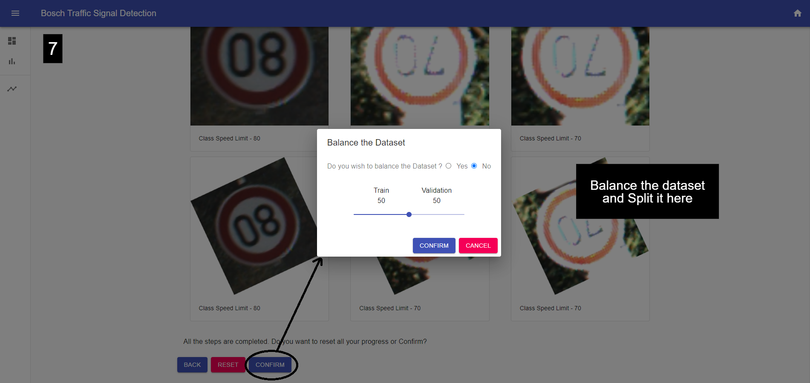
</div>

> **Note**: Make sure you have integrated the firebase to the backend for the model to work. Refer [Setting up Firebase](#settingupfirebase).

<br>

<h3>Predict</h3>

You can add images and predict their classes as shown.

<div align="center">
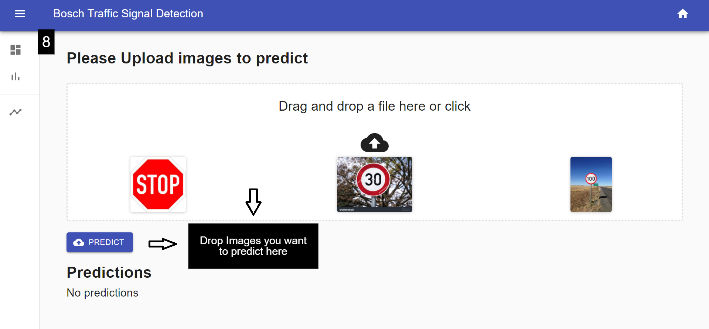
</div>

> **Note**: Make sure you have integrated the firebase to the backend for the model to work. Refer [Setting up Firebase](#settingupfirebase).

<br>

<h2 id="dashboard">Dashboard</h2>

<div align="center">
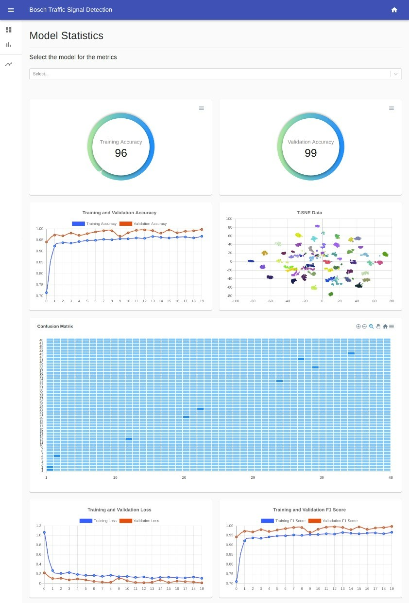
</div>
<br>

- You can select the Model for which you want to analyse the metrics.
- Here you can have access to various information like **Training Accuracy** and **Validation Accuracy** along with their line-charts.
- The user is shown a discrete graph plot of **T-SNE Data**.
- There is a **Confusion Matrix** to analyse and study.
- The user can determine **Training and Validation Loss** and their **F1 Score** through their separate line-charts.
- You can over at any point of **Confusion Matrix** or any other chart to view the statistics of that particular coordinate.
- You can toggle the the view of line-charts to focus on other information by clicking on the legend as shown below:

<div align="center">
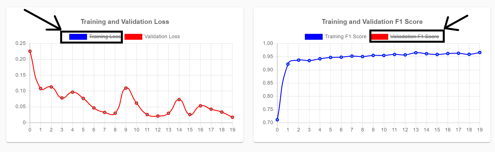
</div>
<br>
